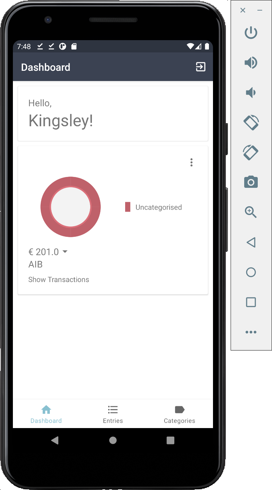
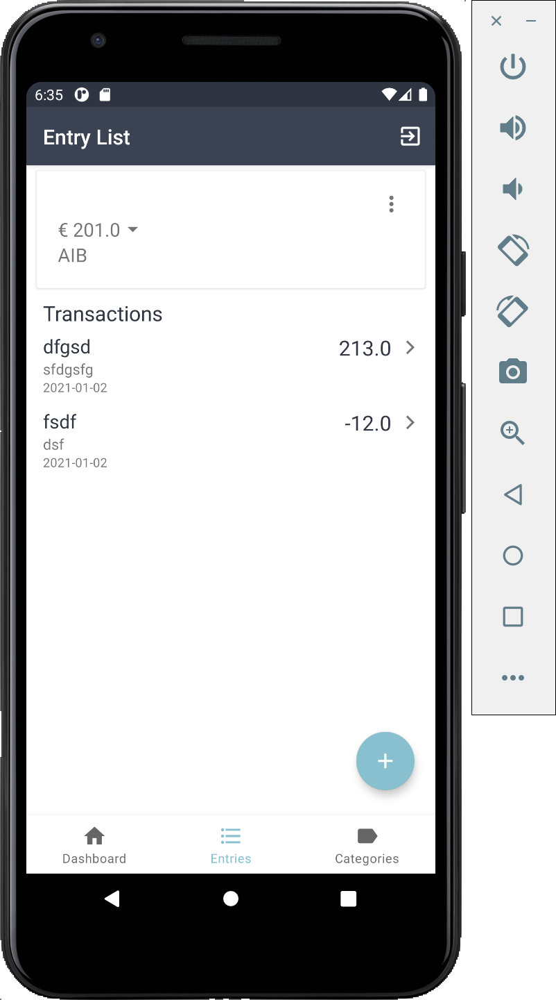
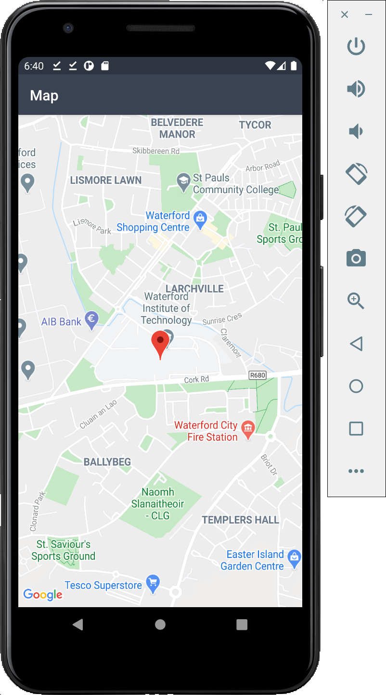
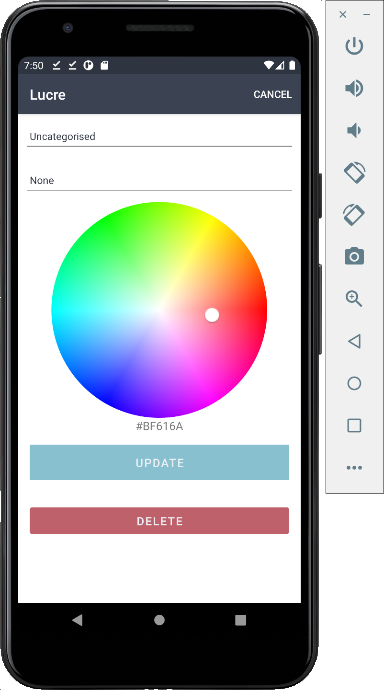

# Lucre
Mobile App Development - Second Assignment

[Link to demo video](https://youtu.be/eEs2fEheDFc)

Lucre is an Android app for keeping track of your income
and expenses. The app has the ability to split your spending
into different categories. The app allows for the use of mutliple
accounts with support for various currencies.

The application uses Firebase authentication and Firebase Firestore
for storing the data.

## Account/Vault View

Once logged in or register, the main view opens up to show a basic dashboard and the name of the signed in user.
From the main menu you will first need to create a vault. Once a vault has been created and expense entries
have been added to the vault, the dashboard will display a pie chart of the expenses broken up into
different categories. You can click on the menu option to open a dialog that will take you to the relevant
activities for creating, updating and deleting vaults.

### Viewing entry transactions

Clicking on the list item in the bottom navbar will take you to the
entry transactions page. You can use the dropdown to select
the vault for which you would like to view the transactions. You can add
new transactions with the floating action button or click on an entry item
to edit it.

### Maps

You can add a location to your entry expense or location using Google maps.
Clicking on the `set location` button in the entry add/edit activity will take
you to a Google maps activity where you can set the location

### Image
You can add a copy of a receipt or payslip to your entry transaction, by clicking on the choose/update image
button in the entry activity

NB Please note that images are not stored in the cloud and can only be added and viewed from a single device.

## Category View

Similar to the entry view, you can click on the FAB to add a new category or
click on an entry item to edit it. The category activity has a color picker built
in to select the color for your chosen category.

## Validation built in
All add and edit views are validated using custom Kotlin extension validation helpers. The form
will only allow you to submit once all the required fileds are filled in. Or, in the case of
an update or edit view, you will only be able to click the update button if
there are changes to the field inputs. You will always be prompted before deleting an entry, vault or category.
